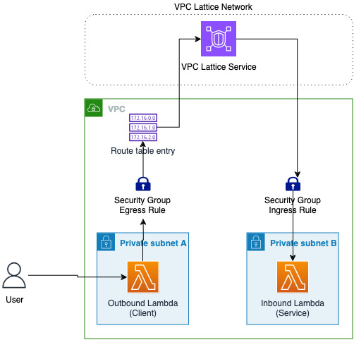

# Serverless Spring Boot 3 example
A pet store application written with the [Spring Boot 3 framework](https://projects.spring.io/spring-boot/). The `LambdaHandler` object is the main entry point for Lambda.

The main resources deployed include:

1. An Outbound Lambda function which acts as a client (the function code is inside the app folder)
2. An Inbound function (the SpringBoot application) that is the target of the VPC Lattice Service.
3. A VPC Lattice Service Network
4. A VPC Lattice Service
5. A VPC Lattice Target Group
6. A VPC

The application uses [VPC Lattice](https://docs.aws.amazon.com/vpc-lattice/latest/ug/what-is-vpc-lattice.html) as a trigger and can be deployed in an AWS account using the [Serverless Application Model](https://github.com/awslabs/serverless-application-model). The `template.yml` file in the root folder contains the application definition.




## Pre-requisites
* [AWS CLI](https://aws.amazon.com/cli/)
* [SAM CLI](https://github.com/awslabs/aws-sam-cli)
* [awscurl](https://github.com/okigan/awscurl)
* [Gradle](https://gradle.org/) or [Maven](https://maven.apache.org/)

## Deployment
In a shell, navigate to the sample's folder and use the SAM CLI to build a deployable package
```
$ sam build
```

This command compiles the application and prepares a deployment package in the `.aws-sam` sub-directory.

To deploy the application in your AWS account, you can use the SAM CLI's guided deployment process and follow the instructions on the screen

```
$ sam deploy --guided
```

Once the deployment is completed, the SAM CLI will print out the stack's outputs, including the new application URL. You can use `awscurl` or a web browser to make a call to the URL

```
...
---------------------------------------------------------------------------------------------------------
OutputKey-Description                                                           OutputValue
---------------------------------------------------------------------------------------------------------
OutboundFunctionUrlEndpoint - Outbound Lambda Function URL Endpoint             https://xxxxxxxxxxxxxx.lambda-url.us-east-1.on.aws/pets
---------------------------------------------------------------------------------------------------------

$ awscurl --service lambda https://xxxxxxxxxxxxxx.lambda-url.us-east-1.on.aws/pets
```
